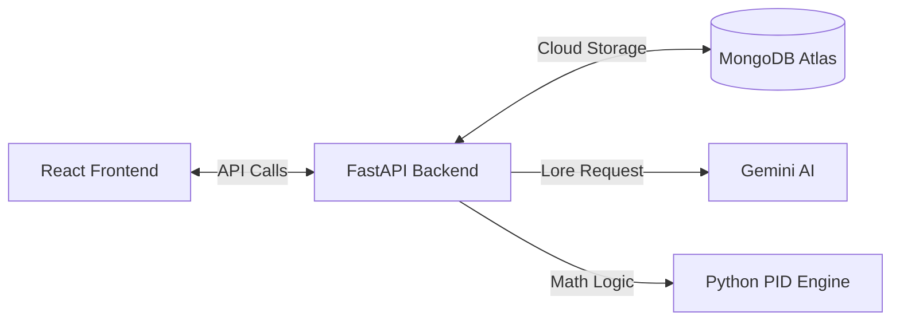

# 💰 Genesis Economy Regulator: The Command Center (Module 1 & 2)


> **"Inflation is the silent killer of MMOs. This AI fixes it—and now it has a Command Center."**

## 📋 Executive Summary
In persistent virtual worlds, wealth sinks are often static, leading to **Hyperinflation**. The **Genesis Economy Regulator** acts as an autonomous Central Bank.

While **Module 1** established the PID Control Logic and economic theory, **Module 2** (The Command Center) integrates this "Brain" into a professional full-stack architecture. [cite_start]The system now autonomously monitors the economy, stores state in the cloud, and provides a real-time HUD for regulators to trigger intervention quests. 

---

## 🚀 Key Features (Updated)
* **🤖 PID Control Logic:** Detects inflation errors and adjusts the Tax Rate (Burn Rate) automatically.
* **🌐 Full-Stack Dashboard:** A high-fidelity React HUD that communicates with the Python backend in real-time.
* **☁️ Persistence:** Integrated with MongoDB Atlas to store economic history and generated quest directives.
* **🧠 Gemini AI Integration:** Uses Generative AI to transform dry economic data into immersive, lore-accurate "Gold Sink" quests.
* **⚡ Live Simulation Trigger:** A "God Mode" button that advances the economic cycle by 1 month and generates new directives instantly.

---

## 🛠️ System Architecture (v2.0)




## 💻 Tech Stack
* Frontend: React, Tailwind CSS, Lucide Icons
* Backend: Python 3.10+, FastAPI, Uvicorn
* AI: Google Gemini (Generative AI)
* Database: MongoDB Atlas (NoSQL)
* Logic: Control Systems Engineering & Macro-Economics

## 🏃 Getting Started (v2.0)

1. Clone & Setup
```Bash
git clone [https://github.com/ryangilbert-github/genesis-economy-regulator.git](https://github.com/ryangilbert-github/genesis-economy-regulator.git)
cd genesis-economy-regulator
```
2. Powering the "Brain" (Python Backend)
The backend handles the PID control logic, MongoDB connection, and Gemini AI integration.

* Install Python dependencies
```bash
pip install -r requirements.txt
```
* Launch the FastAPI server
```bash
uvicorn src.api:app --reload
```
The API will be live at http://127.0.0.1:8000

3. Powering the "HUD" (React Frontend)
The frontend provides the visual Command Center for the regulator.
```Bash
cd frontend
npm install
npm run dev
```
The Dashboard will be live at http://localhost:5173

## 📊 The Math (Control Logic)
The AI operates on a simplified Feedback Control loop:
$$ \text{Tax}{new} = \text{Tax}{old} + K_p \times (\text{Inflation} - \text{Target}) $$

Where:
Inflation: Current Money Supply ($M_1$)
Target: Ideal Baseline
$K_p$: The Proportional Gain (Aggressiveness of the AI strategy)


Author: Ryan Gilbert

Generative AI Engineer & Systems Architect
