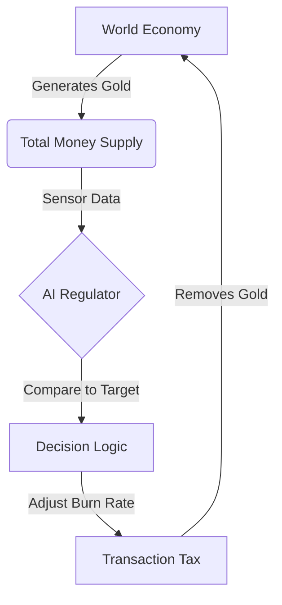

# 💰 Genesis Module 1: AI Central Banker (Economy Regulator)


-orange)


> **"Inflation is the silent killer of MMOs. This AI fixes it."**

## 📋 Executive Summary
In persistent virtual worlds (MMOs), players generate wealth infinitely (killing monsters), but wealth sinks (repair bills) are static. This leads to **Hyperinflation**, rendering currency worthless and destroying the new player experience.

**The Solution:** The **Genesis Economy Regulator** acts as an autonomous Central Bank. It utilizes **Control Theory (Feedback Loops)** to monitor the Global Money Supply in real-time. If inflation spikes—whether due to a "Gold Rush" trend or a massive "Whale Deposit"—the AI dynamically adjusts the Transaction Tax (Burn Rate) to stabilize the economy automatically.

---

## 🚀 Key Features
* **🤖 PID Control Logic:** Detects error (Inflation vs. Target) and applies proportional force (Tax Rate) to correct it.
* **📉 Stress Testing Engine:** Simulate economic shocks like **Gold Rushes** (Trends) and **Whale Deposits** (Impulse Shocks) to validate system resilience.
* **🧠 Multi-Model AI Strategies:** Compare different regulation behaviors:
    * **🦅 The Hawk:** Aggressive, high-tax, instant reaction.
    * **🕊️ The Dove:** Conservative, low-tax, prioritizes player happiness.
    * **⚖️ The Balanced:** The optimal middle ground.
* **📊 Live Telemetry:** Real-time dashboard visualization of Money Supply vs. Tax Rate.

---

## 🛠️ System Architecture

The system operates on a closed-loop feedback cycle.



## 💻 Tech Stack
Core Logic: Python 3.10

Data Processing: Pandas (Time-series analysis)

Visualization: Streamlit

Theory: Control Systems Engineering & Macro-Economics

## 🏃 Getting Started
1. Clone the Repository
```Bash
git clone [https://github.com/ryangilbert-github/genesis-economy-regulator.git](https://github.com/ryangilbert-github/genesis-economy-regulator.git)
cd genesis-economy-regulator
```
2. Install Dependencies
```Bash
pip install pandas numpy streamlit
```
3. Run the Simulation Dashboard
```Bash
python -m streamlit run economy_dashboard.py
```

## 📊 The Math (Control Logic)
The AI operates on a simplified Feedback Control loop:
$$ \text{Tax}{new} = \text{Tax}{old} + K_p \times (\text{Inflation} - \text{Target}) $$
Where:
Inflation: Current Money Supply ($M_1$)
Target: Ideal Baseline
$K_p$: The Proportional Gain (Aggressiveness of the AI strategy)


Author: Ryan Gilbert

Generative AI Engineer & Systems Architect