# 📑 Genesis Module 1: Stress Test Analysis Report
**Subject:** Failure Analysis of "Balanced" Regulator Strategy under High-Impulse Conditions  
**Date:** February 10, 2026  
**TestID:** GEN-SIM-001-BALANCED  

---

## 1. Executive Summary
The "Balanced" AI strategy was subjected to a **High-Impulse Stress Test** (Whale Deposit + Gold Rush). The system failed to maintain the inflation target within acceptable bounds ($\pm$10%).
* **Result:** **CRITICAL FAILURE**
* **Diagnosis:** The Controller exhibits classic **"Under-damped Oscillation,"** reacting too slowly to the initial spike and then over-correcting.

---

## 2. Visual Analysis: The Failure Loop

The following sequence diagram illustrates exactly where the "Balanced" AI failed to react in time (The Lag) and where it failed to stop (The Over-Correction).

```mermaid
sequenceDiagram
    autonumber
    participant W as Whale (External)
    participant E as Economy (Money Supply)
    participant AI as Central Bank AI
    
    Note over E: State: Healthy (1M Gold)
    
    W->>E: 💸 DEPOSIT 2,000,000 GOLD
    E->>E: Inflation Spikes to 300%
    
    loop Reaction Lag (Days 97-105)
        AI->>E: Reads Supply (High)
        AI->>AI: Increases Tax by small step (0.02)
        Note right of AI: Too Slow! Inflation remains high.
    end
    
    Note over AI: Tax eventually hits Max (30%)
    
    loop The Crash (Days 140-160)
        E->>E: Supply Drops Fast
        E->>AI: Supply passes Target (1M)
        AI->>AI: Keeps Tax High (No Derivative Check)
        Note right of AI: ERROR: AI is still braking!
    end
    
    Note over E: State: Depression (365k Gold)
```

## 3. Root Cause: The Missing Derivative
The "Balanced" strategy relies on a simple Proportional Controller loop. It lacks the "D" (Derivative) term from PID theory, meaning it cannot predict future trends.

* **The Problem:** The "AI Decision Logic" node only looks at the current error.

* **The Fix:** It needs to look at the rate of change (Velocity). If the Money Supply is dropping fast, it should lower taxes before it hits the target.

## 4. Recommendations for ProductionImplement "The Hawk" Strategy: 

* Increase the Proportional Gain ($K_p$) to handle impulse spikes.
* Add Derivative Logic (PID):Current Logic: "Inflation is high, so keep taxes high."
* New Logic: "Inflation is high, but falling fast, so start lowering taxes now."

**Signed:** Ryan Gilbert
Lead Generative AI Engineer, Project Genesis
